# 📊 Diagrama de Flujo - Sistema Offline PWA

## 🔄 Flujo General del Sistema

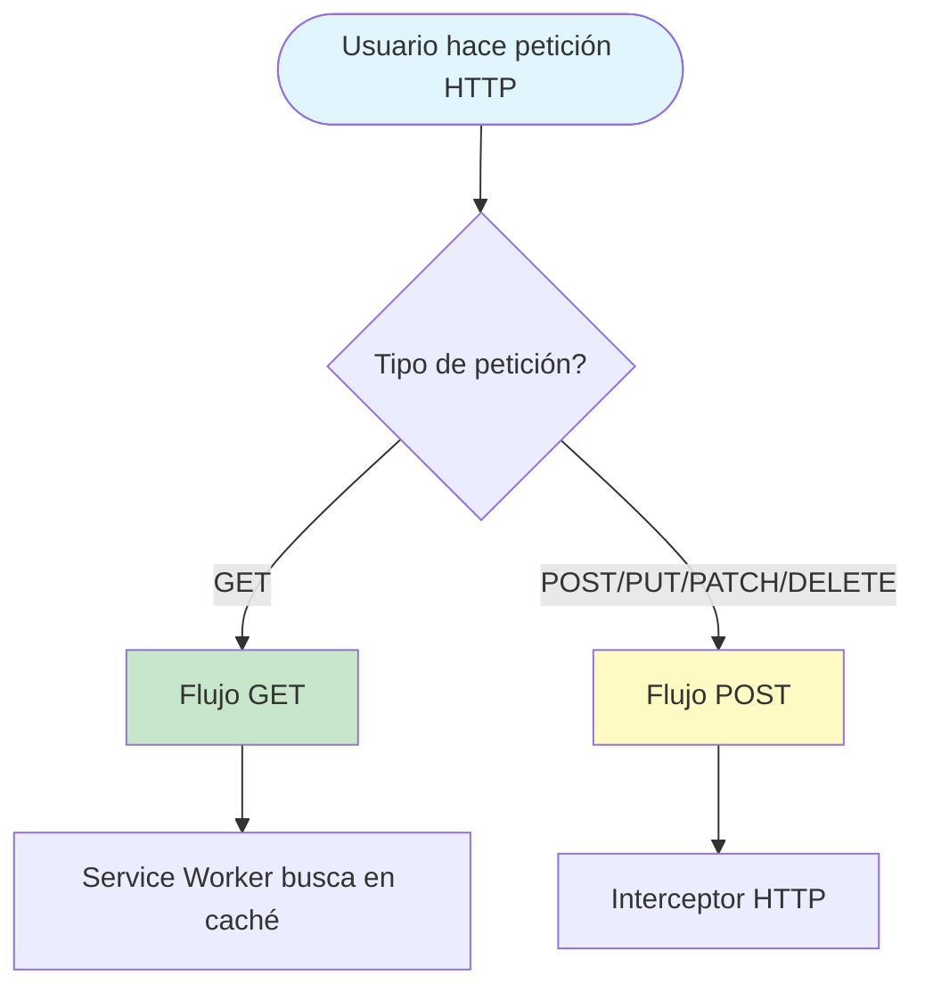

## 📥 Flujo de Peticiones GET

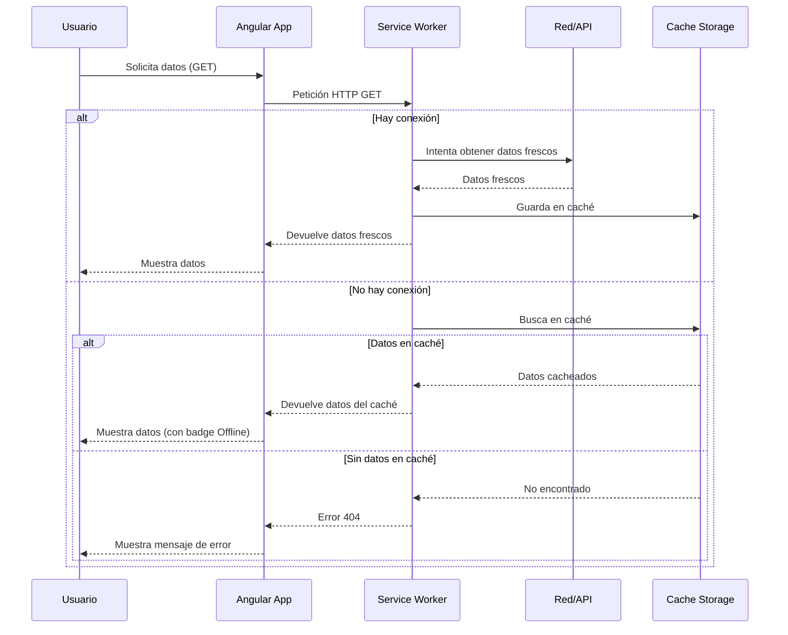

## 📤 Flujo de Peticiones POST/PUT/PATCH/DELETE

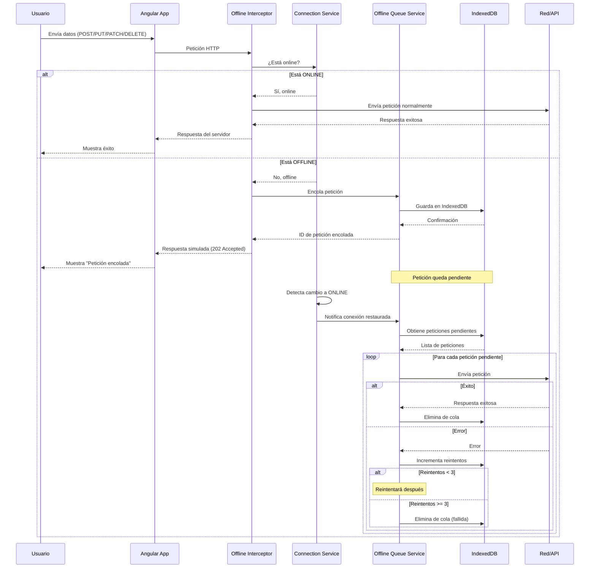

## 🔌 Indicador de Conexión

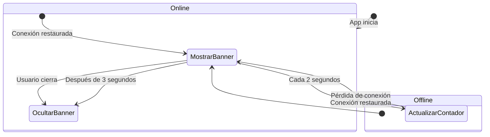

## 🗄️ Estructura de Datos

### IndexedDB - Cola Offline

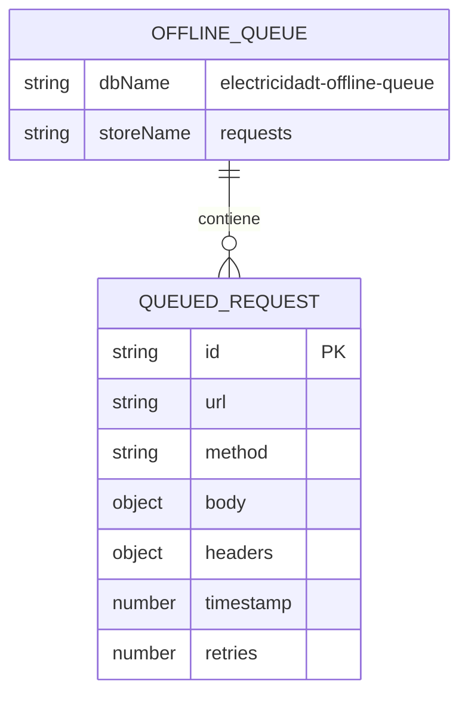

### Cache Storage - Service Worker

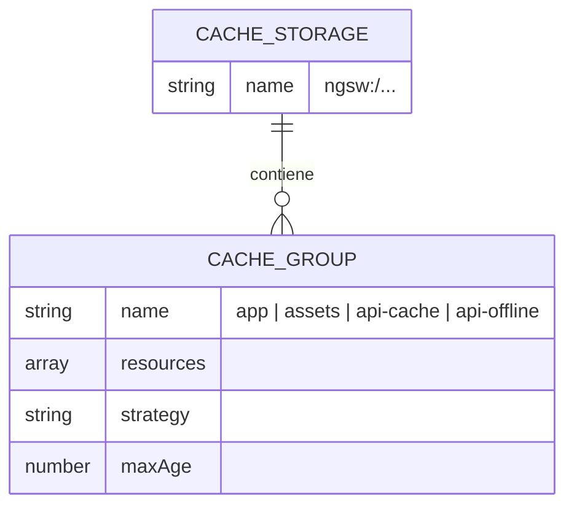

## 🔀 Flujo Completo: Escenario Real

```mermaid
graph TB
    subgraph "Escenario: Usuario trabaja offline"
        A[Usuario abre app] --> B{¿Hay conexión?}
        
        B -->|Sí| C[Carga datos desde API]
        B -->|No| D[Carga datos desde caché]
        
        C --> E[Usuario ve datos frescos]
        D --> F[Usuario ve datos cacheados]
        
        E --> G[Usuario intenta crear factura POST]
        F --> G
        
        G --> H{¿Hay conexión?}
        
        H -->|Sí| I[Envía POST al servidor]
        H -->|No| J[Interceptor detecta offline]
        
        I --> K[Factura creada exitosamente]
        
        J --> L[Encola en IndexedDB]
        L --> M[Muestra mensaje: Petición encolada]
        M --> N[Indicador muestra: 1 pendiente]
        
        N --> O[Usuario sigue trabajando offline]
        O --> P[Crea más facturas]
        P --> Q[Se encolan más peticiones]
        Q --> R[Indicador muestra: 3 pendientes]
        
        R --> S[Usuario vuelve a tener conexión]
        S --> T[ConnectionService detecta cambio]
        T --> U[OfflineQueueService procesa cola]
        
        U --> V[Envía petición 1]
        V --> W[Envía petición 2]
        W --> X[Envía petición 3]
        
        X --> Y[Todas exitosas]
        Y --> Z[Elimina de IndexedDB]
        Z --> AA[Indicador muestra: Conexión restaurada]
        AA --> AB[Indicador se oculta después de 3s]
    end
    
    style A fill:#e1f5ff
    style J fill:#fff9c4
    style L fill:#ffccbc
    style U fill:#c8e6c9
    style Y fill:#c8e6c9
```

## 📱 Componentes del Sistema

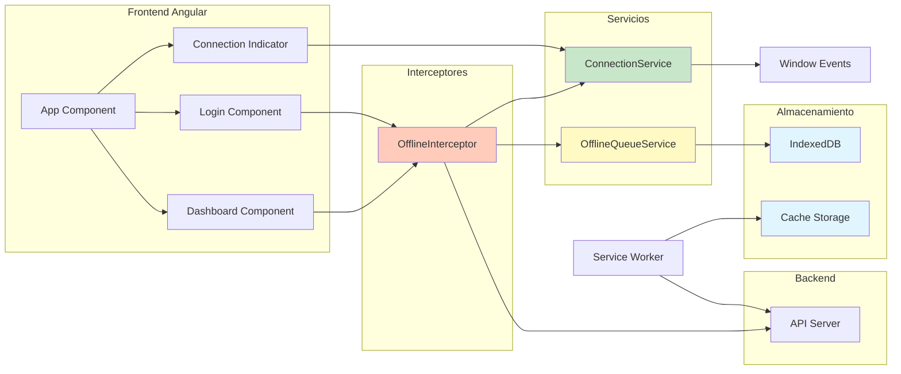

## ⚙️ Configuración del Service Worker

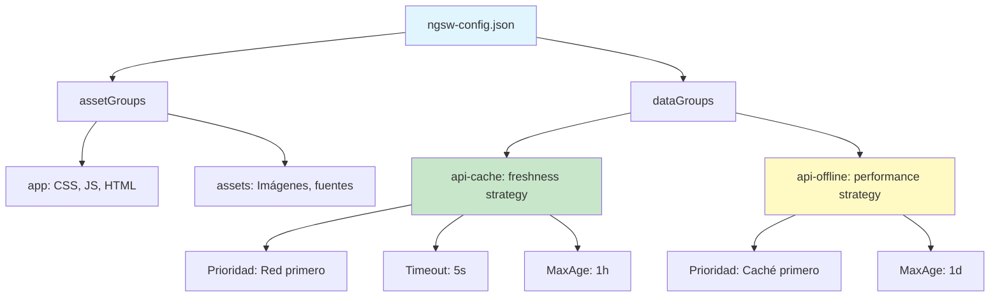

## 🎯 Casos de Uso

### Caso 1: Usuario offline hace GET
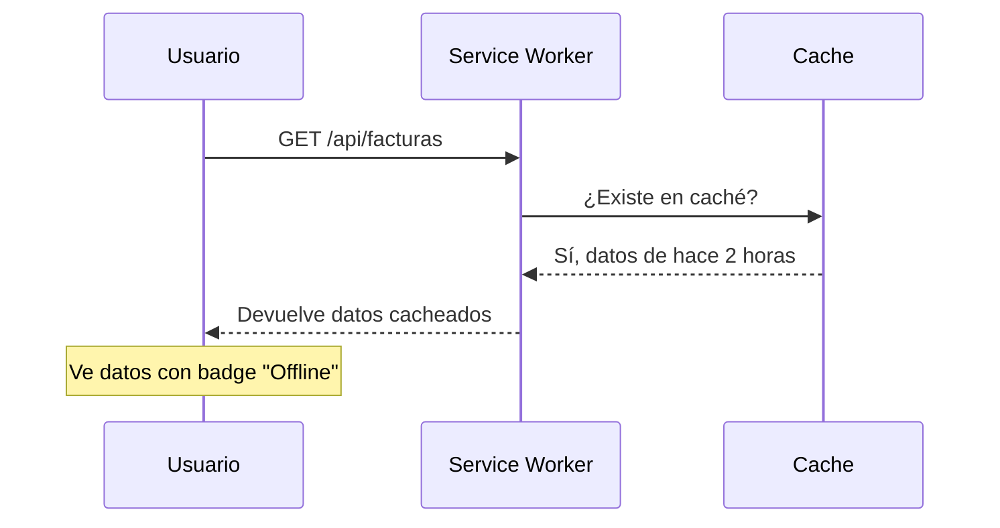

### Caso 2: Usuario offline hace POST
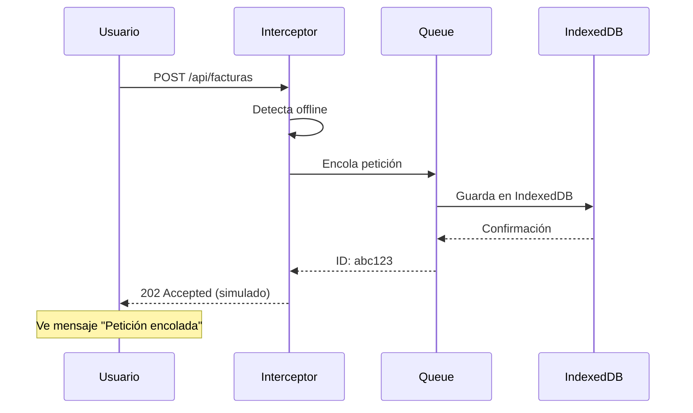

### Caso 3: Conexión restaurada
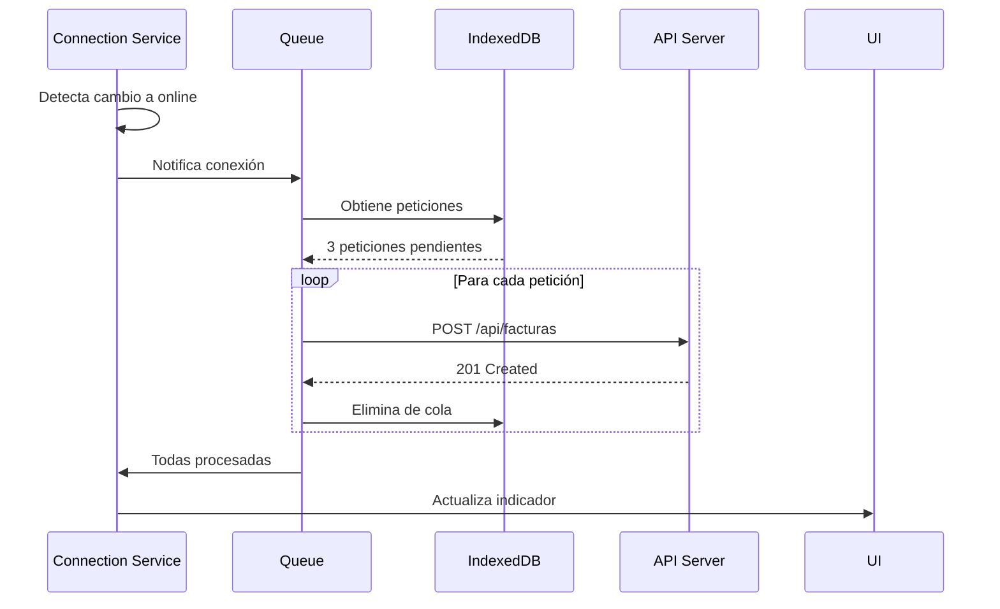

## 📊 Métricas y Estados

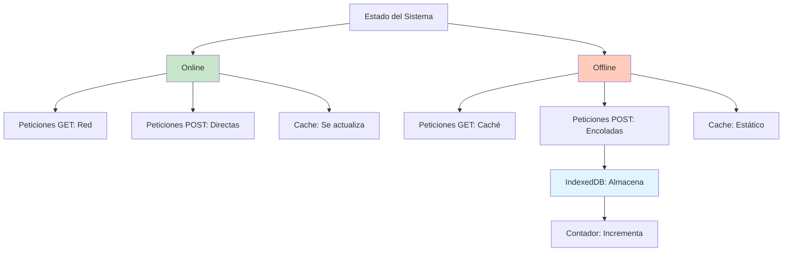

## 🔄 Ciclo de Vida de una Petición POST Offline

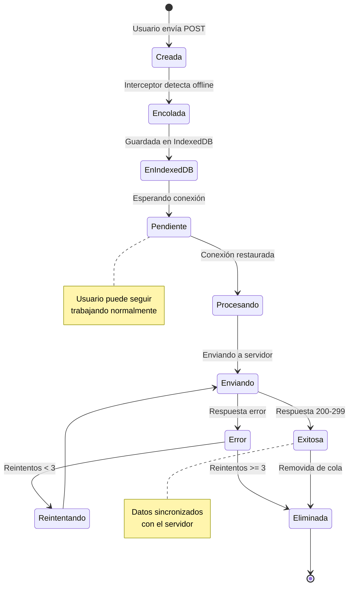
